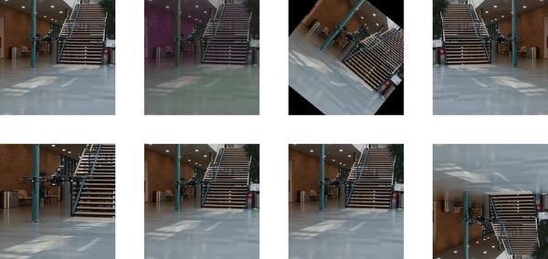

<!--
*** Thanks for checking out the Best-README-Template. If you have a suggestion
*** that would make this better, please fork the repo and create a pull request
*** or simply open an issue with the tag "enhancement".
*** Thanks again! Now go create something AMAZING! :D
***
***
***
*** To avoid retyping too much info. Do a search and replace for the following:
*** iliasprc, videoaugment, twitter_handle, email, videoaugment, project_description
-->


<!-- PROJECT SHIELDS -->
<!--
*** I'm using markdown "reference style" links for readability.
*** Reference links are enclosed in brackets [ ] instead of parentheses ( ).
*** See the bottom of this document for the declaration of the reference variables
*** for contributors-url, forks-url, etc. This is an optional, concise syntax you may use.
*** https://www.markdownguide.org/basic-syntax/#reference-style-links
-->
[![Contributors][contributors-shield]][contributors-url]
[![Forks][forks-shield]][forks-url]
[![Stargazers][stars-shield]][stars-url]
[![Issues][issues-shield]][issues-url]
[![MIT License][license-shield]][license-url]
[![LinkedIn][linkedin-shield]][linkedin-url]


<!-- PROJECT LOGO -->
<br />
<p align="center">
  <a href="https://github.com/iliasprc/videoaugment">
    
  </a>

  <h3 align="center">videoaugment</h3>

  <p align="center">
    Video augmentation techniques for PyTorch

Differently from `torchvision` that applies different augmentation to each image, this library applies the same augmentations on each frame of the video.
    <br />
    <a href="https://github.com/iliasprc/videoaugment"><strong>Explore the docs »</strong></a>
    <br />
    <br />
    <a href="https://github.com/iliasprc/videoaugment">View Demo</a>
    ·
    <a href="https://github.com/iliasprc/videoaugment/issues">Report Bug</a>
    ·
    <a href="https://github.com/iliasprc/videoaugment/issues">Request Feature</a>
  </p>

<p align="center">
  <a href="https://github.com/iliasprc/videoaugment">
    
  </a>
</p>


<!-- TABLE OF CONTENTS -->
<details open="open">
  <summary><h2 style="display: inline-block">Table of Contents</h2></summary>
  <ol>
    <li>
      <a href="#about-the-project">About The Project</a>
      <ul>
        <li><a href="#built-with">Built With</a></li>
      </ul>
    </li>
    <li>
      <a href="#getting-started">Getting Started</a>
      <ul>
        <li><a href="#prerequisites">Prerequisites</a></li>
        <li><a href="#installation">Installation</a></li>
      </ul>
    </li>
    <li><a href="#usage">Usage</a></li>
    <li><a href="#roadmap">Roadmap</a></li>
    <li><a href="#contributing">Contributing</a></li>
    <li><a href="#license">License</a></li>
    <li><a href="#contact">Contact</a></li>
    <li><a href="#acknowledgements">Acknowledgements</a></li>
  </ol>
</details>


<!-- ABOUT THE PROJECT -->
## About The Project

[![Product Name Screen Shot][product-screenshot]](https://example.com)

Here's a blank template to get started:
**To avoid retyping too much info. Do a search and replace with your text editor for the following:**
`iliasprc`, `videoaugment`, `twitter_handle`, `email`, `videoaugment`, `project_description`


### Built With

* []()
* []()
* []()


<!-- GETTING STARTED -->
## Getting Started

To get a local copy up and running follow these simple steps.

### Prerequisites

This is an example of how to list things you need to use the software and how to install them.

  ```
  pip install torch 
  numpy 
  scikit-image 
  scipy
  einops
 
  ```

### Installation

1. Clone the repo
   ```sh
   pip install git+https://github.com/iliasprc/videoaugment.git
   ```


<!-- USAGE EXAMPLES -->
## Usage

Use this space to show useful examples of how a project can be used. Additional screenshots, code examples and demos work well in this space. You may also link to more resources.

_For more examples, please refer to the [Documentation](https://example.com)_

### Video augmentations
```python
import videoaugment.transforms as VA

st = VA.ComposeSpatialTransforms(
    transforms=[VA.CenterCrop(512), VA.Resize(256), VA.RandomCrop(crop_size=dim[0], img_size=256),
                VA.RandomColorAugment(brightness=0.2, contrast=0.2, hue=0.2,
                                      saturation=0.2),
                VA.RandomRotation(10), VA.RandomHorizontalFlip(0.5), VA.Rescale(1. / 255.0),
                VA.PILToTensor(),
                VA.RearrangeTensor(),
                VA.Normalize((0.485, 0.456, 0.406), (0.229, 0.224, 0.225))])
tt = VA.ComposeTemporalTransforms(
    transforms=[VA.RandomTemporalDownsample(0.5), VA.TemporalElasticTransformation(),
                VA.TemporalScale(num_of_frames=time_steps), VA.VideoToTensor()])
videogen = skvideo.io.vreader(path)
video = []
for frame in videogen:
    augmented_frame = st(frame)
    video.append(augmented_frame)
video_tensor = tt(video)

```
### Video dataloader


```python
import videoaugment.loader as VL

loader = VL.VideoDataset(config=dataset_config, mode=train_prefix, classes=classes)


```

<!-- ROADMAP -->
## Roadmap

See the [open issues](https://github.com/iliasprc/videoaugment/issues) for a list of proposed features (and known issues).


<!-- CONTRIBUTING -->
## Contributing

Contributions are what make the open source community such an amazing place to be learn, inspire, and create. Any contributions you make are **greatly appreciated**.

1. Fork the Project
2. Create your Feature Branch (`git checkout -b feature/AmazingFeature`)
3. Commit your Changes (`git commit -m 'Add some AmazingFeature'`)
4. Push to the Branch (`git push origin feature/AmazingFeature`)
5. Open a Pull Request


<!-- LICENSE -->
## License

Distributed under the MIT License. See `LICENSE` for more information.


<!-- CONTACT -->
## Contact

Ilias Papastratis - email [iliaspapastrat@gmail.com]() 

Project Link: [https://github.com/iliasprc/videoaugment](https://github.com/iliasprc/videoaugment)


<!-- ACKNOWLEDGEMENTS -->
## Acknowledgements

* []()
* []()
* []()


<!-- MARKDOWN LINKS & IMAGES -->
<!-- https://www.markdownguide.org/basic-syntax/#reference-style-links -->


[contributors-shield]: https://img.shields.io/github/contributors/iliasprc/videoaugment.svg?style=for-the-badge
[contributors-url]: https://github.com/iliasprc/videoaugment/graphs/contributors
[forks-shield]: https://img.shields.io/github/forks/iliasprc/videoaugment.svg?style=for-the-badge
[forks-url]: https://github.com/iliasprc/videoaugment/network/members
[stars-shield]: https://img.shields.io/github/stars/iliasprc/videoaugment.svg?style=for-the-badge
[stars-url]: https://github.com/iliasprc/videoaugment/stargazers
[issues-shield]: https://img.shields.io/github/issues/iliasprc/videoaugment.svg?style=for-the-badge
[issues-url]: https://github.com/iliasprc/videoaugment/issues
[license-shield]: https://img.shields.io/github/license/iliasprc/videoaugment.svg?style=for-the-badge
[license-url]: https://github.com/iliasprc/videoaugment/blob/master/LICENSE.txt
[linkedin-shield]: https://img.shields.io/badge/-LinkedIn-black.svg?style=for-the-badge&logo=linkedin&colorB=555
[linkedin-url]: https://www.linkedin.com/in/ilias-papastratis-16819412a/
